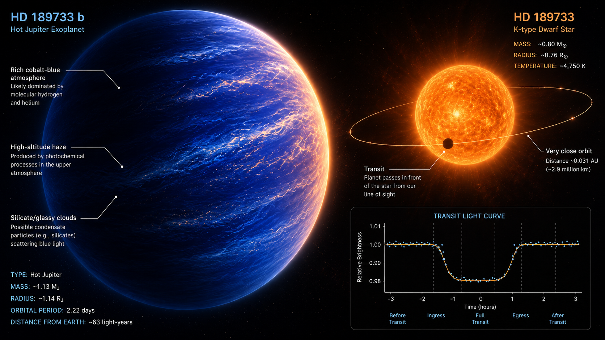

# HD 189733 b Transit Photometry

**Author:** Biswajit Jana  
**Notebook:** `HD189733b_Transit_Photometry.ipynb`

<p align="center">
  
</p>

## About

This is a small Google Colab project for exploring **exoplanet transit photometry** using public TESS light-curve data. The default target is **HD 189733 b**, a well-studied hot Jupiter with a deep transit, but the notebook is written so that users can try other known transiting planets by changing the target settings.

The notebook downloads real public TESS light curves, uses published planet parameters from the NASA Exoplanet Archive, aligns the observed data using the known transit ephemeris, stacks individual transit windows, measures the transit depth, and estimates simple physical parameters such as planet radius and radius ratio.

This is not intended to be a full publication-level transit fit. It is a readable, forkable starting point for learning how the transit method works.

---


Suggested topics:

```text
exoplanets
transit-photometry
hd189733b
tess
lightkurve
nasa-exoplanet-archive
astronomy-python
google-colab
citizen-science
```

---

## What the notebook does

The notebook walks through a simple but realistic transit-photometry workflow:

1. Choose a target planet.
2. Query planet and stellar parameters from the NASA Exoplanet Archive.
3. Download real public TESS light curves using Lightkurve.
4. Use the published period and transit midpoint to locate transits in the data.
5. Extract and locally normalise each transit window.
6. Stack the individual transits into one folded light curve.
7. Measure the transit depth.
8. Estimate simple physical parameters from the dip.
9. Save the plots and summary tables.

---

## Is this real data?

Yes. The scatter points in the final plot come from real public TESS light-curve products downloaded through Lightkurve.

The notebook does **not** inject a fake transit signal. It uses the published orbital period and transit midpoint to align the observed TESS measurements. The smooth curve in the final figure is a binned version of the real folded data.

In simple terms:

```text
real TESS flux measurements
+ known orbital period and transit time
+ local normalisation
+ stacked transits
= recovered transit light curve
```

---

## Why HD 189733 b?

HD 189733 b is a useful first target because it is a bright, nearby, well-studied hot Jupiter with a relatively deep transit. That makes the transit signal easier to recover than many smaller or shallower planets.

It is also scientifically interesting because HD 189733 is an active K-type star, and the planet has been studied extensively in both optical and infrared transit observations.

---

## Trying other targets

The notebook includes a target-selection section near the top.

To try another preset target, change:

```python
TARGET_KEY = "HD 189733 b"
```

Available presets currently include:

```text
HD 189733 b
HD 209458 b
WASP-12 b
HAT-P-32 b
```

You can also use a custom target by setting:

```python
CUSTOM_MODE = True
```

and editing the custom target block.

Good beginner targets usually have:

- bright host stars,
- deep transits,
- short orbital periods,
- published ephemerides,
- available TESS light curves.

For shallow planets, the dip may not be obvious without more sectors, better detrending, or a physical transit model.

---

## What can be estimated from the dip?

The simplest transit relation is:

$$
\delta \approx \left(\frac{R_p}{R_\star}\right)^2
$$

where $\delta$ is the fractional transit depth. Therefore:

$$
\frac{R_p}{R_\star} \approx \sqrt{\delta}
$$

If the stellar radius is known, the planet radius can be estimated as:

$$
R_p \approx R_\star \sqrt{\delta}
$$

The notebook uses this to estimate:

- measured transit depth,
- planet-to-star radius ratio, $R_p/R_\star$,
- planet radius in Earth radii,
- planet radius in Jupiter radii,
- approximate bulk density, if planet mass is available,
- approximate equilibrium temperature,
- approximate transit probability.

These are first-order estimates, not a replacement for a full transit model.

---

## Output files

After running the notebook, the `outputs/` folder contains:

```text
target_info.csv
01_tess_light_curve.png
stacked_transit_points.csv
binned_transit.csv
derived_physical_parameters.csv
final_transit_plot.png
transit_photometry_results.zip
```

The main figure is:

```text
final_transit_plot.png
```

---

## Repository structure

```text
HD189733b_Transit_Photometry.ipynb
README.md
assets/
  hd189733b_cover.png
```

---

## How to run

Open the notebook in Google Colab:

```text
HD189733b_Transit_Photometry.ipynb
```

Then run the notebook from top to bottom.

The notebook installs the required packages:

```bash
pip install lightkurve pandas numpy matplotlib astropy
```

---

## Notes and limitations

This notebook is designed for learning and experimentation.

It does not include:

- a full physical transit model,
- limb-darkening fitting,
- starspot modelling,
- correlated-noise treatment,
- Bayesian posterior sampling,
- sector-by-sector validation.

HD 189733 is an active star, so real residuals can include stellar activity and starspot effects. The results should therefore be treated as a first exploration rather than a final scientific measurement.

---

## Future ideas

Possible upgrades for this project:

- add more preset planets,
- add sector-by-sector comparison,
- add an optional `batman` transit model overlay,
- add a Box Least Squares search cell for unknown periods,
- add support for uploaded ground-based observation CSV files,
- compare SAP and PDCSAP flux,
- turn the workflow into a small web tool for public users.

---

## Acknowledgements

This project uses public data and open-source astronomy tools, including:

- TESS public light-curve data,
- Lightkurve for working with TESS light curves,
- NASA Exoplanet Archive for published planet and stellar parameters,
- Astropy, NumPy, Pandas, and Matplotlib for scientific Python analysis.

---

## References

Bakos, G. Á., Knutson, H., Pont, F., Moutou, C., Charbonneau, D., Shporer, A., Bouchy, F., Everett, M., Hergenrother, C., Latham, D. W., Mayor, M., Mazeh, T., Noyes, R. W., Queloz, D., Pal, A. and Udry, S. (2006) ‘Refined parameters of the planet orbiting HD 189733’, *The Astrophysical Journal*.

Bouchy, F. et al. (2005) ‘ELODIE metallicity-biased search for transiting Hot Jupiters II. A very hot Jupiter transiting the bright K star HD 189733’, *Astronomy & Astrophysics*.

Lightkurve Collaboration et al. (2018) ‘Lightkurve: Kepler and TESS time series analysis in Python’, *Astrophysics Source Code Library*.

NASA Exoplanet Archive (n.d.) ‘Planetary Systems Composite Parameters and TAP service’, NASA Exoplanet Science Institute.

Pont, F. et al. (2007) ‘Hubble Space Telescope time-series photometry of the planetary transit of HD 189733: no moon, no rings, starspots’, *Astronomy & Astrophysics*.

Ricker, G. R. et al. (2015) ‘Transiting Exoplanet Survey Satellite’, *Journal of Astronomical Telescopes, Instruments, and Systems*.

Beaulieu, J. P., Carey, S., Ribas, I. and Tinetti, G. (2008) ‘Primary transit of the planet HD 189733 b at 3.6 and 5.8 microns’, *The Astrophysical Journal*.
