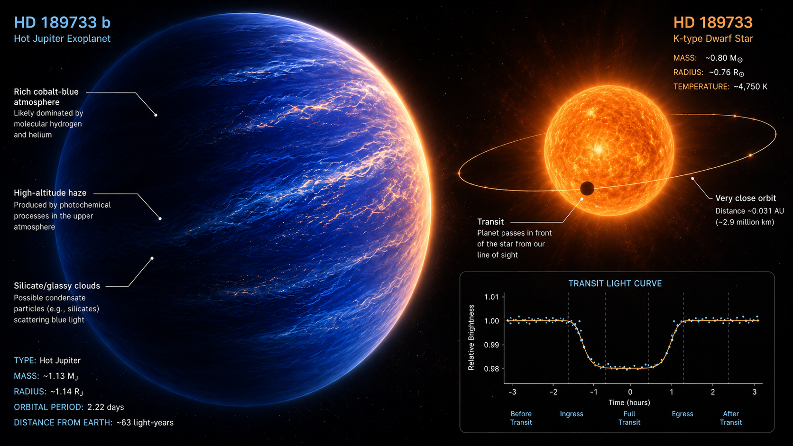
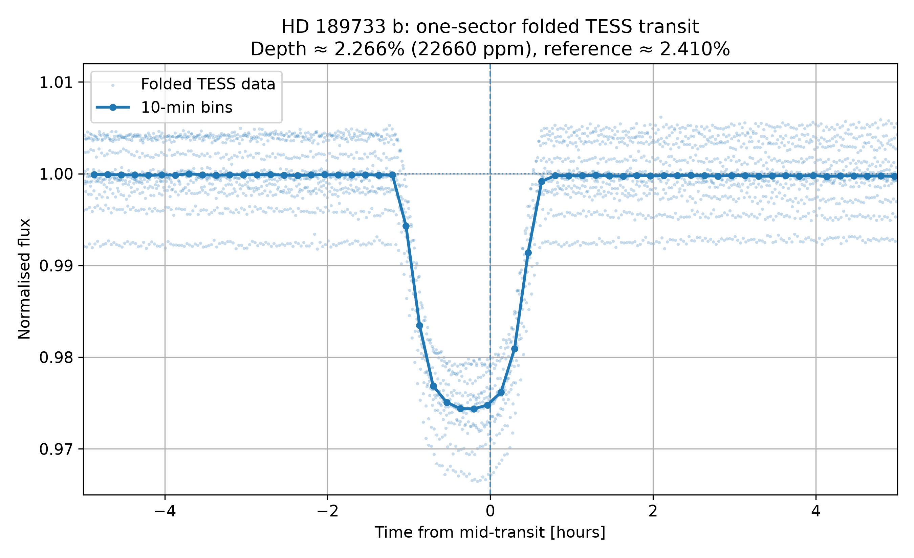

# HD 189733 b Transit Photometry

**Author:** Biswajit Jana  
**Notebook:** `HD189733b_Transit_Photometry.ipynb`

<p align="center">
  
</p>

## About

This is a small Google Colab project for exploring **exoplanet transit photometry** using public TESS light-curve data. The default target is **HD 189733 b**, a well-studied hot Jupiter with a deep transit, but the notebook is written so that users can try other known transiting planets by changing the target settings.

The notebook downloads real public TESS light curves, uses published planet parameters from the NASA Exoplanet Archive, aligns the observed data using the known transit ephemeris, stacks individual transit windows, measures the transit depth, and estimates simple physical parameters such as planet radius and radius ratio.

This is not intended to be a full publication-level transit fit. It is a readable, forkable starting point for learning how the transit method works.

The exact estimand, selection rule, uncertainty calculation, and inference
limits are documented in [METHODS.md](METHODS.md).

## Reproduced result

The checked-in outputs were regenerated from the public SPOC 120-second light
curve for **TESS Sector 41**
(`tess2021204101404-s0041-0000000256364928-0212-s_lc.fits`). The coverage-only
rule selected this product before its transit depth was considered.

Across 11 locally normalized transit events, the median depth is **2.266%**
(22,660 ppm). A fixed-seed, 5,000-resample event bootstrap gives a central 68%
interval of **2.247–2.307%**. The corresponding first-order radius ratio is
**Rp/Rs = 0.1505**. These values are conditional on the pipeline product,
ephemeris fit, baseline definition, and approximation stated in the methods.



---


Suggested topics:

```text
exoplanets
transit-photometry
hd189733b
tess
lightkurve
nasa-exoplanet-archive
astronomy-python
google-colab
citizen-science
```

---

## What the notebook does

The notebook walks through a simple but realistic transit-photometry workflow:

1. Choose a target planet.
2. Query planet and stellar parameters from the NASA Exoplanet Archive.
3. Download real public TESS light curves using Lightkurve.
4. Select a product by a prespecified coverage rule: most valid cadences,
   with the lowest product index as the tie-break. Expected transit depth is
   never used for product selection.
5. Use the published period and transit midpoint to locate transits, then fit
   a bounded epoch offset as an explicit nuisance parameter.
6. Normalize every usable transit against its own out-of-transit baseline.
7. Aggregate per-transit depths with the median and report a deterministic
   5,000-resample event-bootstrap interval.
8. Stack the observed transit windows into a folded light curve.
9. Estimate simple physical parameters from the measured depth.
10. Save the plots, per-event measurements, provenance, and summary tables.

---

## Is this real data?

Yes. The scatter points in the final plot come from real public TESS light-curve products downloaded through Lightkurve.

The notebook does **not** inject a fake transit signal. It uses the published orbital period and transit midpoint to align the observed TESS measurements. The smooth curve in the final figure is a binned version of the real folded data.

In simple terms:

```text
real TESS flux measurements
+ known orbital period and transit time
+ local normalisation
+ stacked transits
= recovered transit light curve
```

---

## Why HD 189733 b?

HD 189733 b is a useful first target because it is a bright, nearby, well-studied hot Jupiter with a relatively deep transit. That makes the transit signal easier to recover than many smaller or shallower planets.

It is also scientifically interesting because HD 189733 is an active K-type star, and the planet has been studied extensively in both optical and infrared transit observations.

---

## Trying other targets

The notebook includes a target-selection section near the top.

To try another preset target, change:

```python
TARGET_KEY = "HD 189733 b"
```

Available presets currently include:

```text
HD 189733 b
HD 209458 b
WASP-12 b
HAT-P-32 b
```

You can also use a custom target by setting:

```python
CUSTOM_MODE = True
```

and editing the custom target block.

Good beginner targets usually have:

- bright host stars,
- deep transits,
- short orbital periods,
- published ephemerides,
- available TESS light curves.

For shallow planets, the dip may not be obvious without more sectors, better detrending, or a physical transit model.

---

## What can be estimated from the dip?

The simplest transit relation is:

$$
\delta \approx \left(\frac{R_p}{R_\star}\right)^2
$$

where $\delta$ is the fractional transit depth. Therefore:

$$
\frac{R_p}{R_\star} \approx \sqrt{\delta}
$$

If the stellar radius is known, the planet radius can be estimated as:

$$
R_p \approx R_\star \sqrt{\delta}
$$

The notebook uses this to estimate:

- measured transit depth,
- planet-to-star radius ratio, $R_p/R_\star$,
- planet radius in Earth radii,
- planet radius in Jupiter radii,
- approximate bulk density, if planet mass is available,
- approximate equilibrium temperature,
- approximate transit probability.

These are first-order estimates, not a replacement for a full transit model.

---

## Output files

After running the notebook, the `outputs/` folder contains:

```text
target_info.csv
01_selected_tess_light_curve.png
02_folded_transit.png
per_transit_depths.csv
transit_depth_summary.csv
physical_properties_from_transit.csv
```

The main figure is:

```text
02_folded_transit.png
```

---

## Repository structure

```text
HD189733b_Transit_Photometry.ipynb
README.md
METHODS.md
requirements.txt
assets/
  hd189733b_cover.png
data/
  analysis-contract.json
outputs/
  generated figures and machine-readable result tables
scripts/
  repository and notebook validators
```

---

## How to run

Open the notebook in Google Colab:

```text
HD189733b_Transit_Photometry.ipynb
```

Then run the notebook from top to bottom.

The notebook installs bounded versions of the required packages. The same
constraints are recorded in `requirements.txt`:

```bash
pip install -r requirements.txt
```

---

## Notes and limitations

This notebook is designed for learning and experimentation.

The notebook deliberately separates product selection from the expected
depth: coverage determines the product, while the published depth is shown
only afterward as a comparison. This prevents the reported agreement from
being manufactured by choosing the sector whose answer was already closest
to the reference.

It does not include:

- a full physical transit model,
- limb-darkening fitting,
- starspot modelling,
- correlated-noise treatment,
- Bayesian posterior sampling,
- sector-by-sector validation,
- a dilution/crowding correction beyond the selected pipeline product,
- a covariance-aware treatment of time-correlated stellar activity.

HD 189733 is an active star, so real residuals can include stellar activity and starspot effects. The results should therefore be treated as a first exploration rather than a final scientific measurement.

---

## Next scientific extensions

Possible upgrades for this project:

- add more preset planets,
- add sector-by-sector comparison,
- add an optional `batman` transit model overlay,
- add a Box Least Squares search cell for unknown periods,
- add support for uploaded ground-based observation CSV files,
- compare SAP and PDCSAP flux,
- turn the workflow into a small web tool for public users.

---

## Acknowledgements

This project uses public data and open-source astronomy tools, including:

- TESS public light-curve data,
- Lightkurve for working with TESS light curves,
- NASA Exoplanet Archive for published planet and stellar parameters,
- Astropy, NumPy, Pandas, and Matplotlib for scientific Python analysis.

---

## References

Bakos, G. Á., Knutson, H., Pont, F., Moutou, C., Charbonneau, D., Shporer, A., Bouchy, F., Everett, M., Hergenrother, C., Latham, D. W., Mayor, M., Mazeh, T., Noyes, R. W., Queloz, D., Pal, A. and Udry, S. (2006) ‘Refined parameters of the planet orbiting HD 189733’, *The Astrophysical Journal*.

Bouchy, F. et al. (2005) ‘ELODIE metallicity-biased search for transiting Hot Jupiters II. A very hot Jupiter transiting the bright K star HD 189733’, *Astronomy & Astrophysics*.

Lightkurve Collaboration et al. (2018) ‘Lightkurve: Kepler and TESS time series analysis in Python’, *Astrophysics Source Code Library*.

NASA Exoplanet Archive (n.d.) ‘Planetary Systems Composite Parameters and TAP service’, NASA Exoplanet Science Institute.

Pont, F. et al. (2007) ‘Hubble Space Telescope time-series photometry of the planetary transit of HD 189733: no moon, no rings, starspots’, *Astronomy & Astrophysics*.

Ricker, G. R. et al. (2015) ‘Transiting Exoplanet Survey Satellite’, *Journal of Astronomical Telescopes, Instruments, and Systems*.

Beaulieu, J. P., Carey, S., Ribas, I. and Tinetti, G. (2008) ‘Primary transit of the planet HD 189733 b at 3.6 and 5.8 microns’, *The Astrophysical Journal*.
